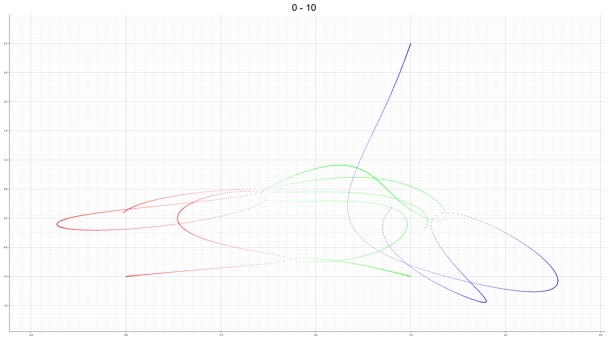
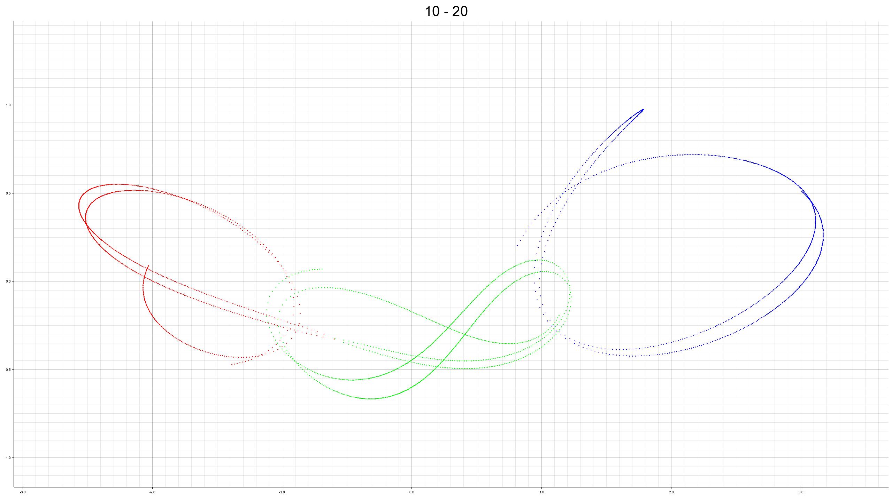
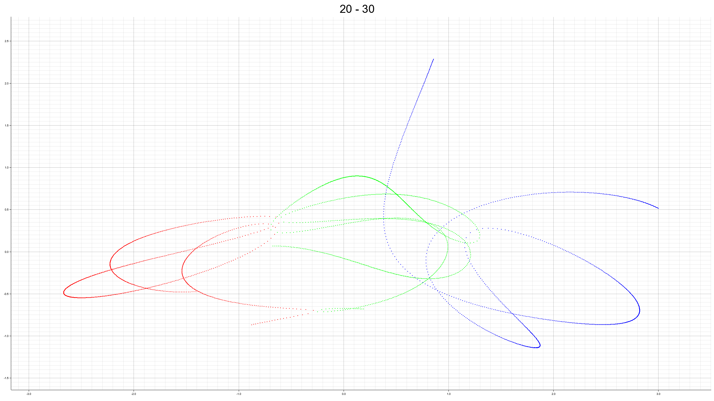
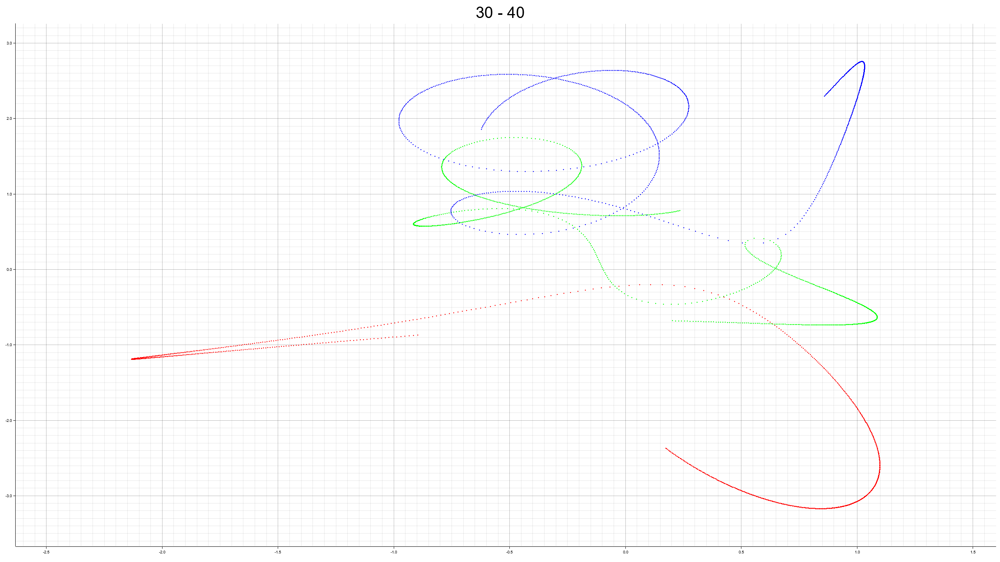
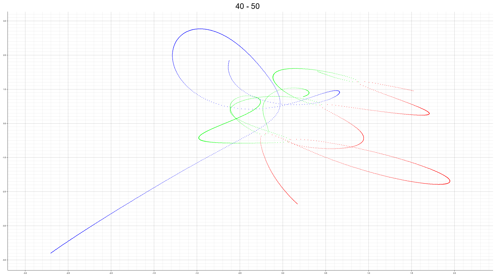
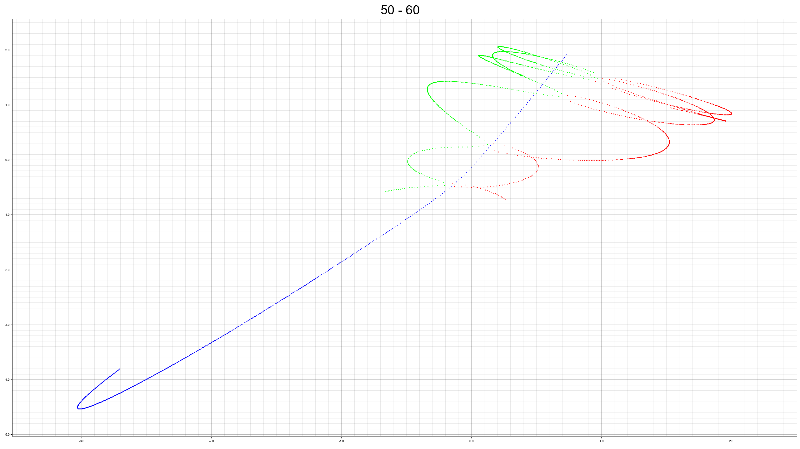
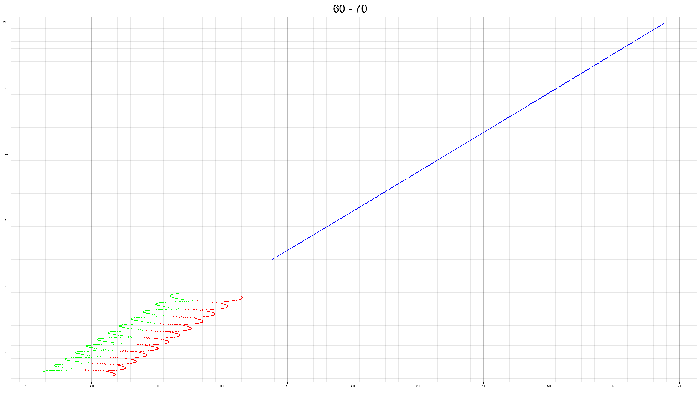

# （重力）多体問題の数値実験乗

重力多体問題の実験場。

## 参考文献
### 日本語
基本文献。
- [Makino J. (2001), 重力多体系の数値計算](https://repository.kulib.kyoto-u.ac.jp/dspace/bitstream/2433/97012/1/KJ00004711437.pdf)
- [Kepler問題におけるKustaanheimo-Stiefel変換](https://osanshouo.github.io/blog/2021/04/12-kustaanheimo-stiefel/)
- [谷川清隆 訳、Prasenjit Saha and Scott Tremaine (1992), Symplectic integrators for solar system dynamics](http://th.nao.ac.jp/MEMBER/tanikawa/list08/saha/st1.pdf)
- [正則化法と全保存型差分法を用いた重力N体問題のシミュレーション](https://catalog.lib.kyushu-u.ac.jp/opac_download_md/14286/Article_No_14.pdf)
- [Makino J. , 6 計算法 --- 時間領域](https://jun-makino.sakura.ne.jp/papers/bussei-nbody/node7.html)

### 英語
ピタゴラス3体問題。
- [Szebehely, Victor; Peters, C. Frederick (1967). “Complete solution of a general problem of three bodies”. The Astronomical Journal 72: 876.](https://ui.adsabs.harvard.edu/abs/1967AJ.....72..876S/abstract)

## ピタゴラス3体問題

